## Przerobienie przykładu z https://bezkoder.com/django-react-axios-rest-framework/

### settings.py:

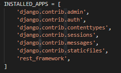
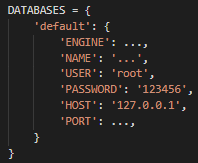

### Tworzymy apke "tutorial"

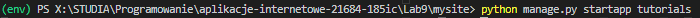

### pip install django-cors-headers:

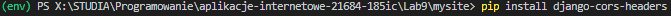

### Adding corsheaders:

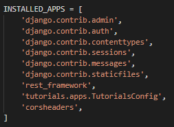
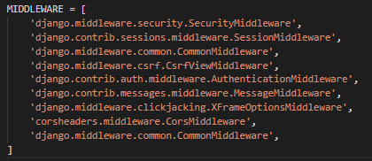
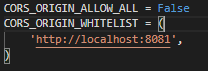

### Define model:

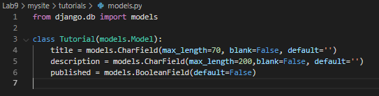

### python manage.py makemigrations tutorials

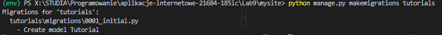

### tutorials\migrations\0001_initial.py

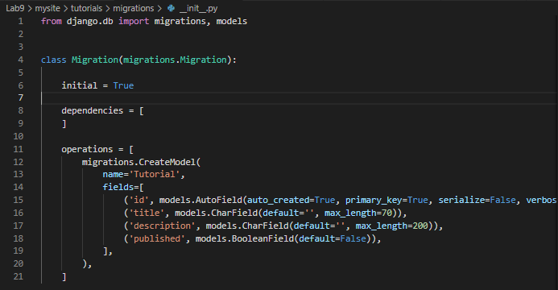

### python manage.py migrate tutorials

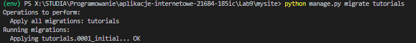

### Add serializers.py

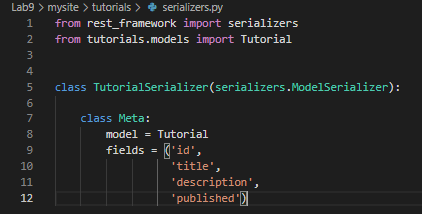

### Add tutorials/urls.py

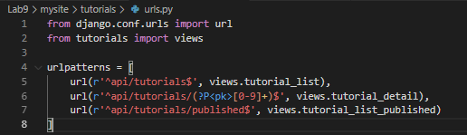

### mysite/urls.py

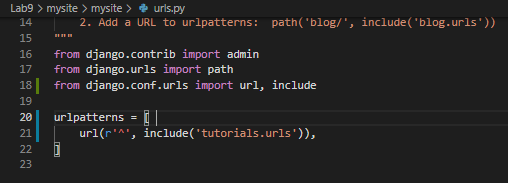

### tutorials/views.py

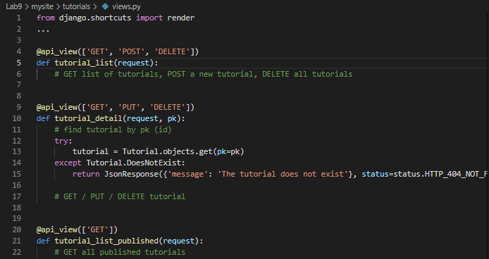

### python manage.py runserver

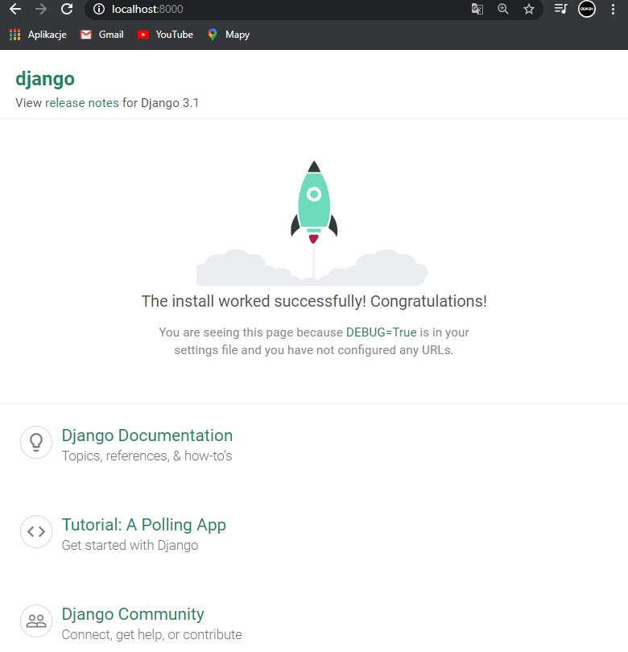

# CDN
