# Laboratorium nr 10 -  Django TODO app

Install djangorestframework django-cors-headers - DRF

### settings.py
'corsheaders.middleware.CorsMiddleware' -> DODAJEMY NA SAMEJ GÓRZE
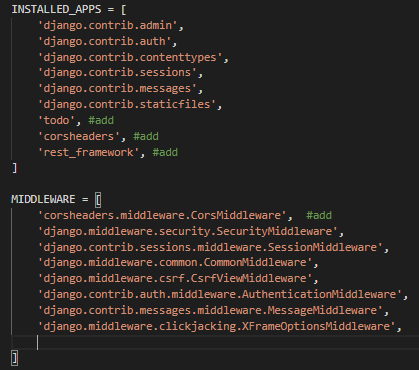

### models.py - modele todo
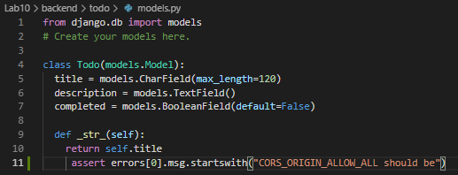

### admin.py - tworzenie modeli do panelu admina
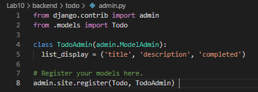

### serializers.py - serializers todo
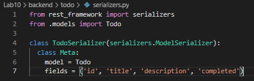

### urls.py - scieżki
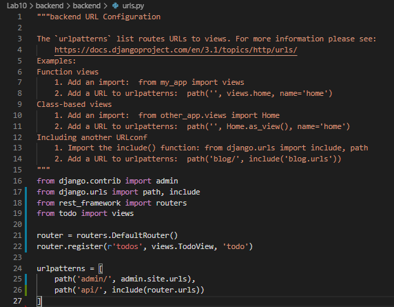

## Stawianie fronendu:

npm install -g create-react-app
create-react-app frontend
npm install --global yarn
yarn add bootstrap reactstrap
npm install axios --save

## Moesif Origin & CORS Changer:
Dodatkowa instalacja rozszerzenia do przegladarki do poprawnego działania duetu django + react

## Wygląd aplikacji z poradnika:
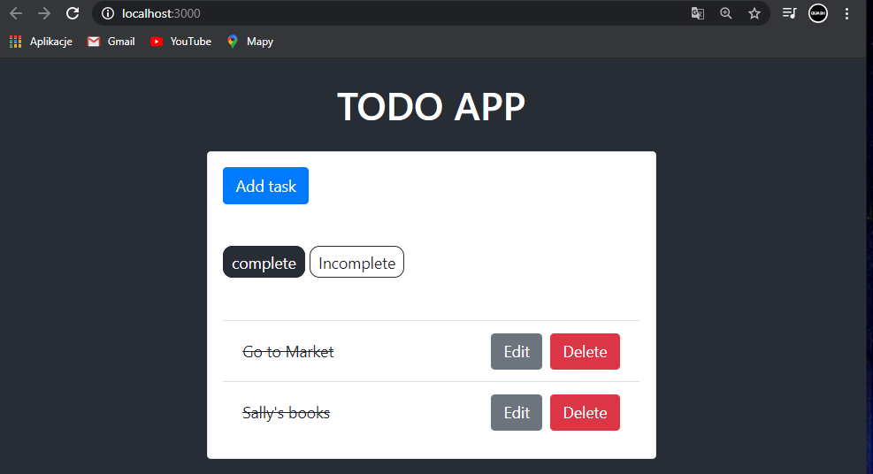

## http://localhost:8000/admin/
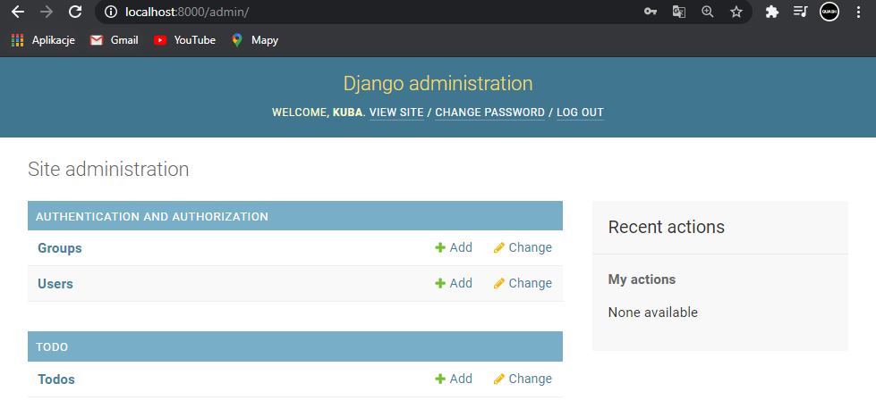

## Komponenty - Modal.js:
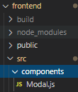

## Index.js
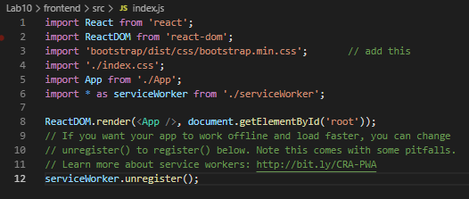

## własne dodawanie zadań - incomplete
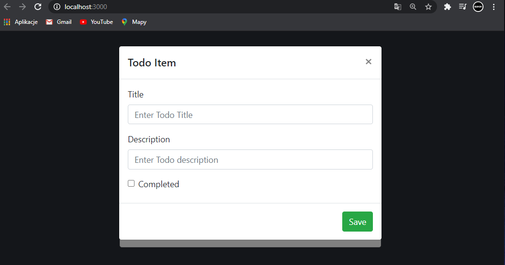
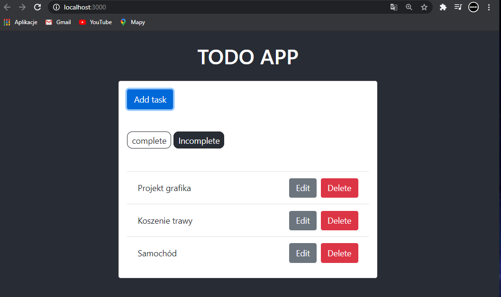

## własne dodawanie zadań - complete
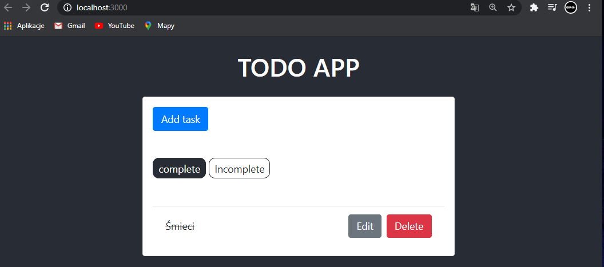

## widok zadań z api
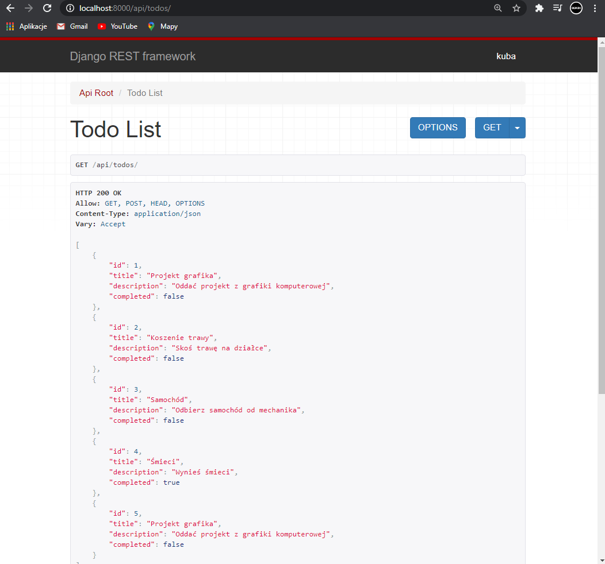

## Modyfikacja settings.py 
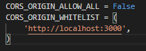
