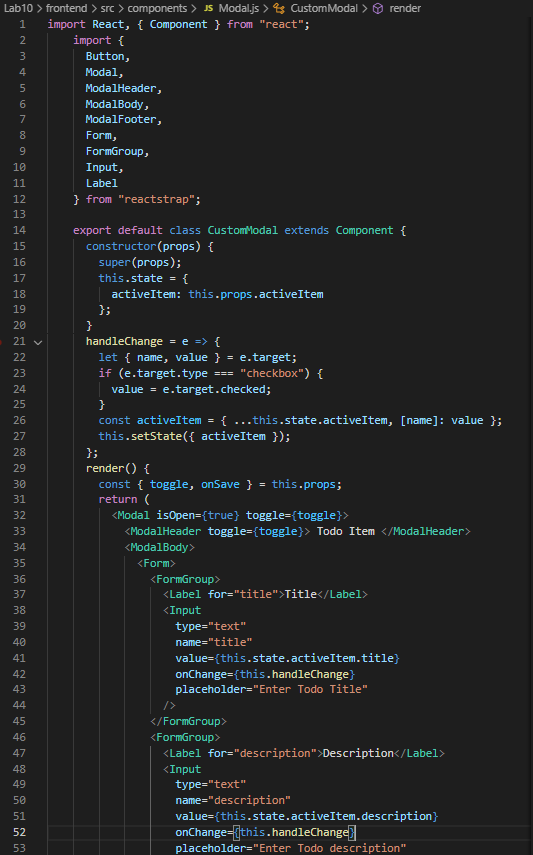

# Laboratorium nr 10 -  Django TODO app

Install djangorestframework django-cors-headers - DRF

### settings.py
'corsheaders.middleware.CorsMiddleware' -> DODAJEMY NA SAMEJ GÓRZE

### models.py - modele todo

### admin.py - tworzenie modeli do panelu admina

### serializers.py - serializers todo

### urls.py - scieżki

## Stawianie fronendu:

npm install -g create-react-app
create-react-app frontend
npm install --global yarn
yarn add bootstrap reactstrap
npm install axios --save

## Moesif Origin & CORS Changer:
Dodatkowa instalacja rozszerzenia do przegladarki do poprawnego działania duetu django + react

## Wygląd aplikacji z poradnika:

## http://localhost:8000/admin/

## Komponenty - Modal.js:

## Index.js

## własne dodawanie zadań - incomplete

## własne dodawanie zadań - complete

## widok zadań z api

## Modyfikacja settings.py 

