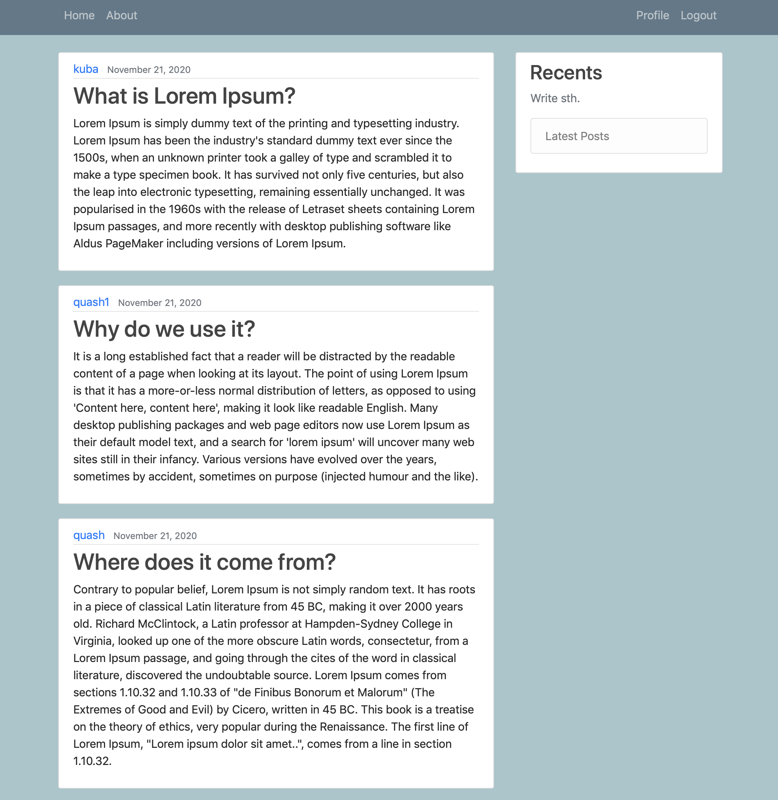
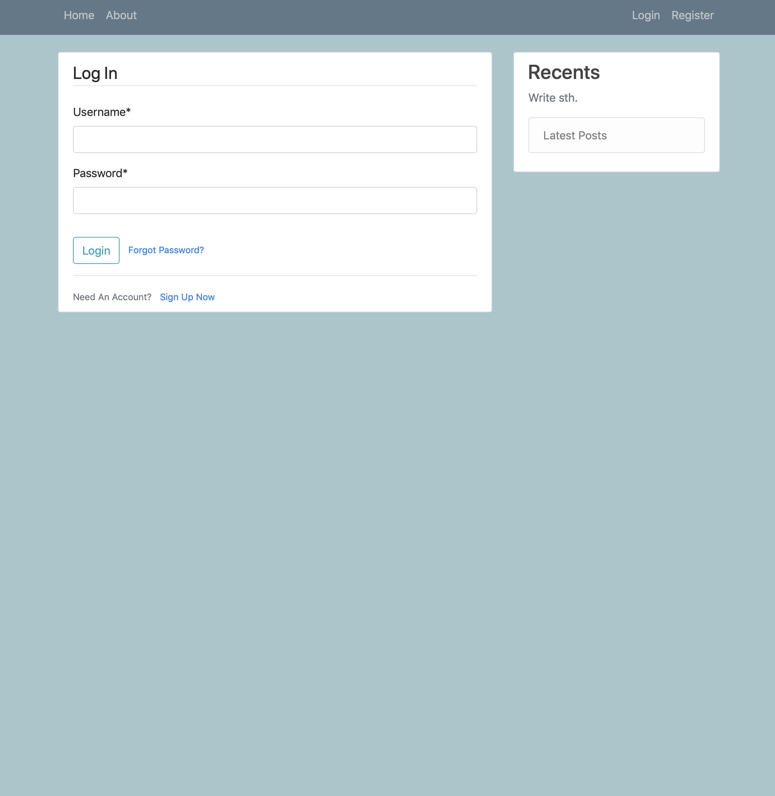
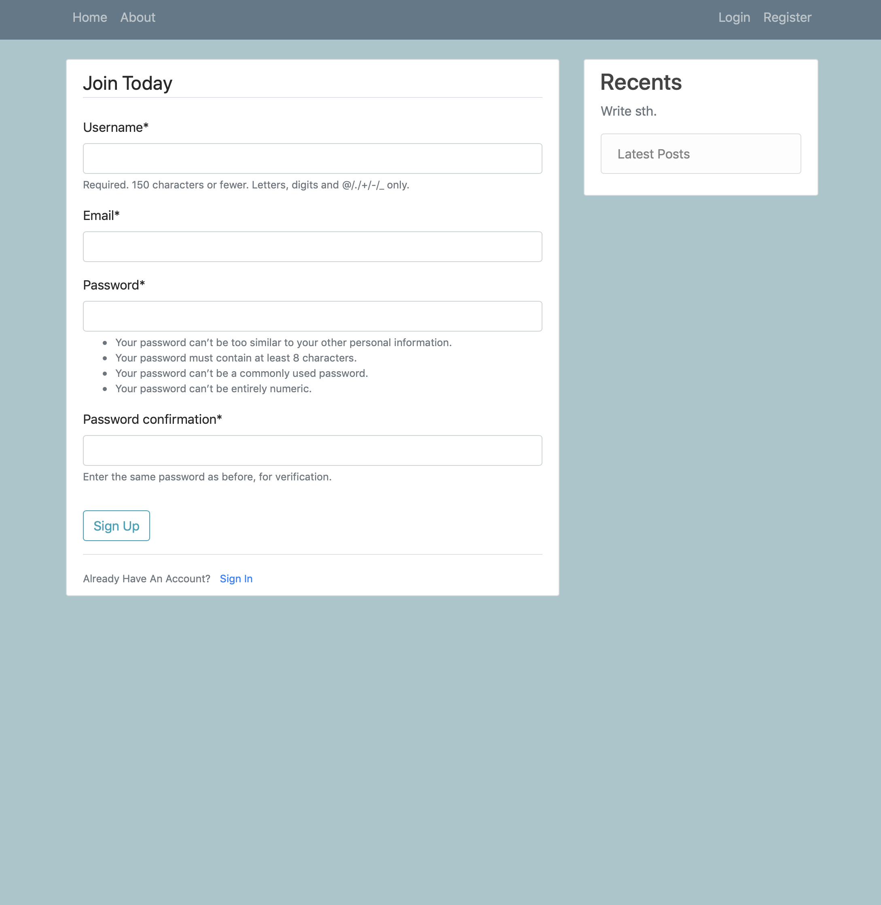
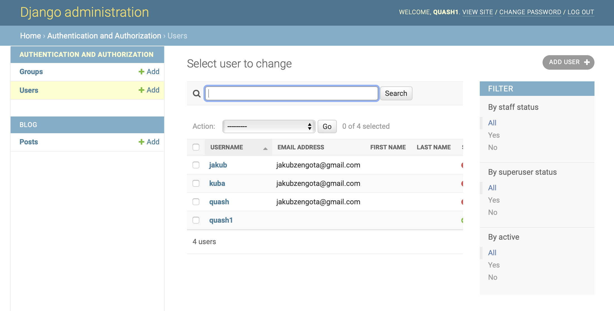
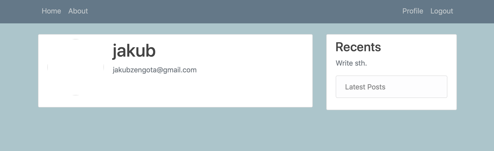
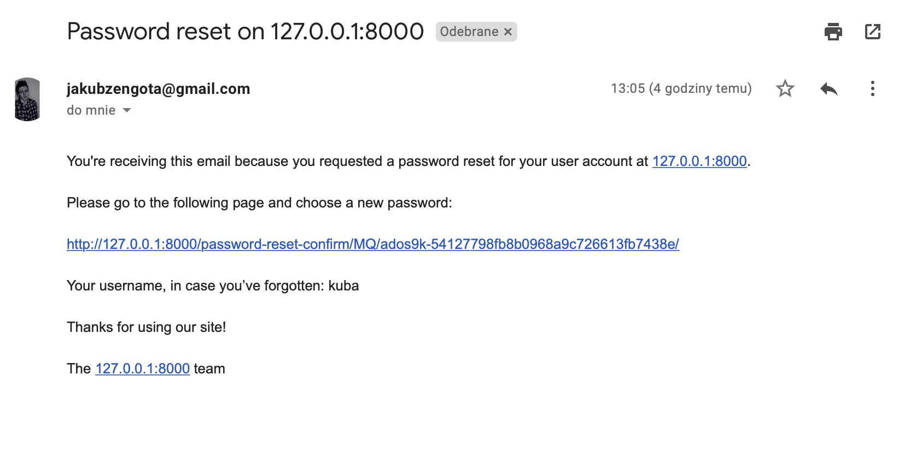
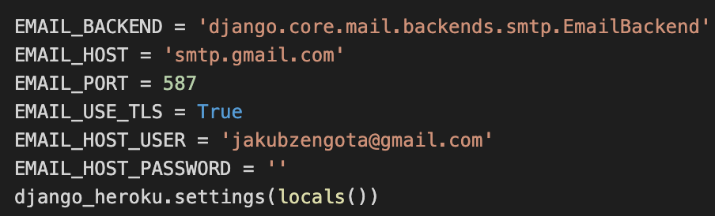

# Laboratorium nr 2 - Rejestracja i logowanie

Wygląd strony startowej

Logowanie dla uźytkowników

Rejestracja

Resetowanie hasła:

Widok userów dla admina

Widok profilu zalogowane uzytkownika

Mail zwrotny z linkiem do resetu hasła. Chciałem zrobić konsolową treść maila, ale skorzystałem z app google i maile są wysyłane za pomocą gmaila. 

Kod dot. mailów. Hasło zostawiłem puste

