# Laboratorium nr 3 - Logowania za pomocą fb i google

Do wykonania laborki posłuzylem się projektem z Lab2

Wygląd strony logowania:
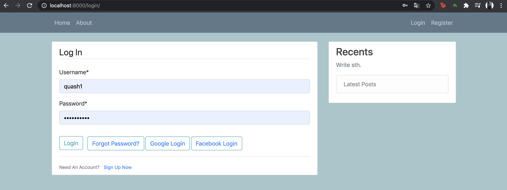

Google Login:
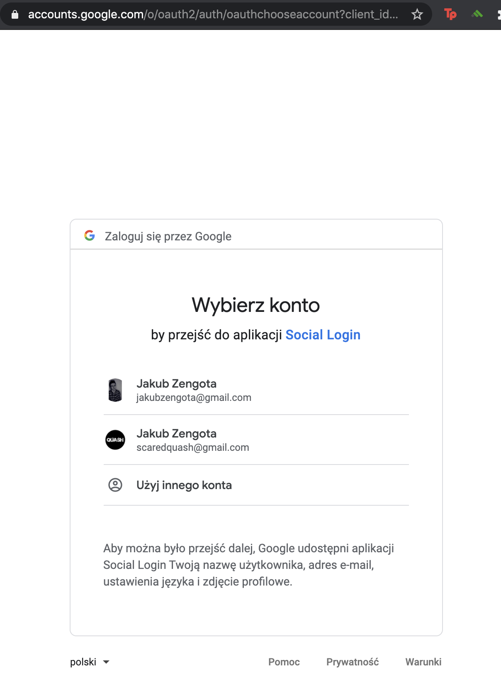
po zalogowaniu:
pomyslnie zalogowany nowy uzytkownik:
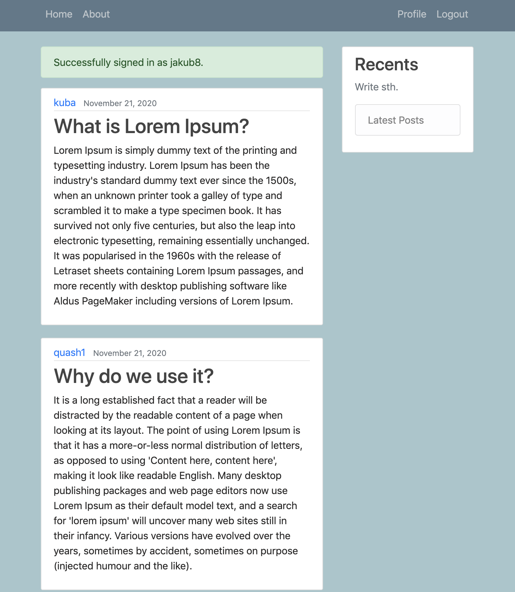
profil zalogowanego uzytkownika:
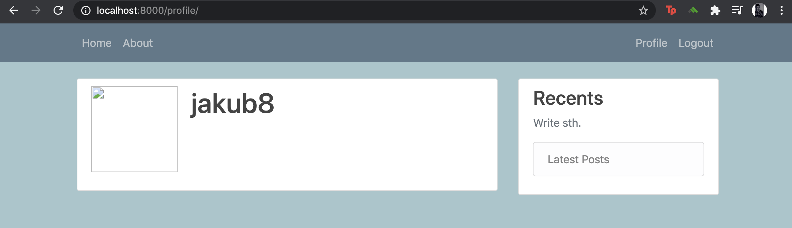
Ustawienia developerskie google:
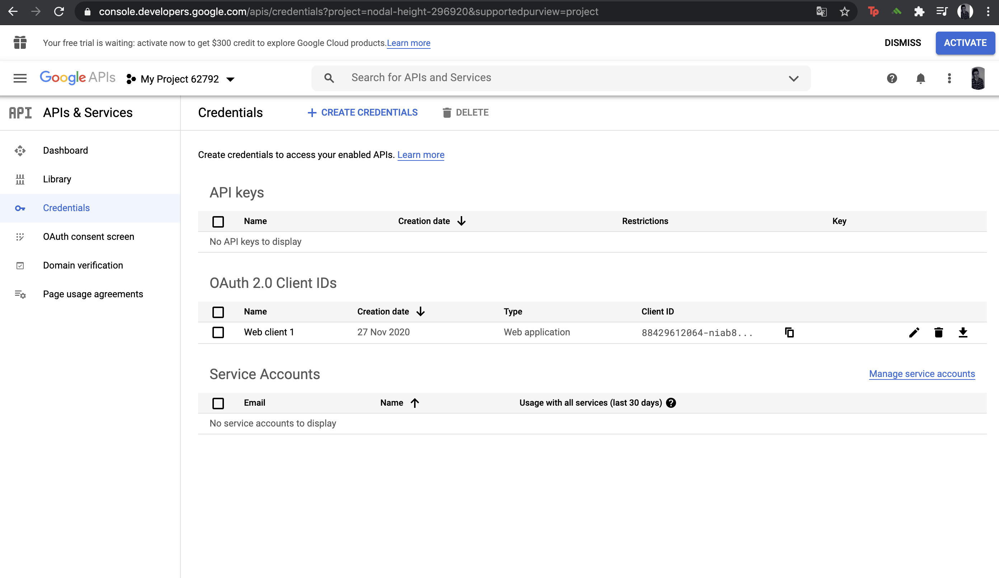
Facebook Login:
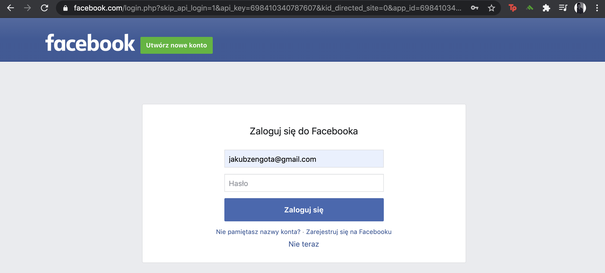
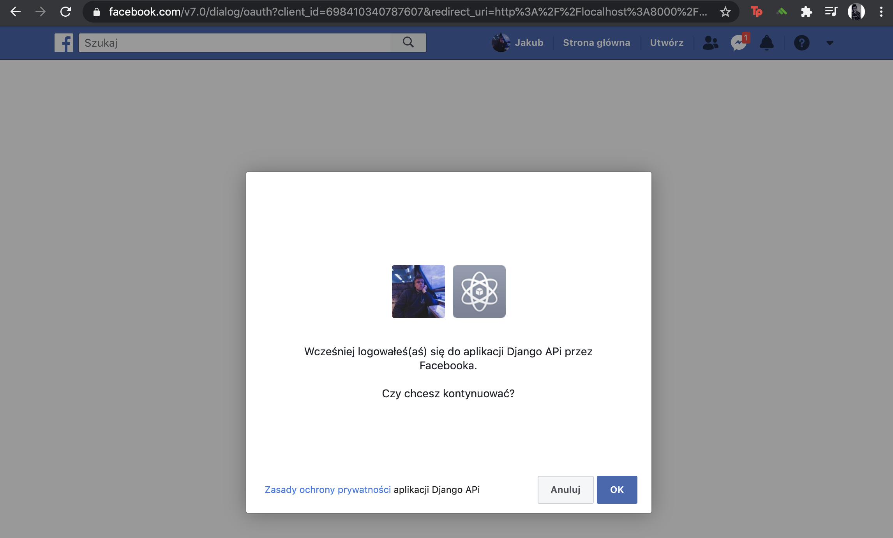
po zalogowaniu:
pomyslnie zalogowany nowy uzytkownik:
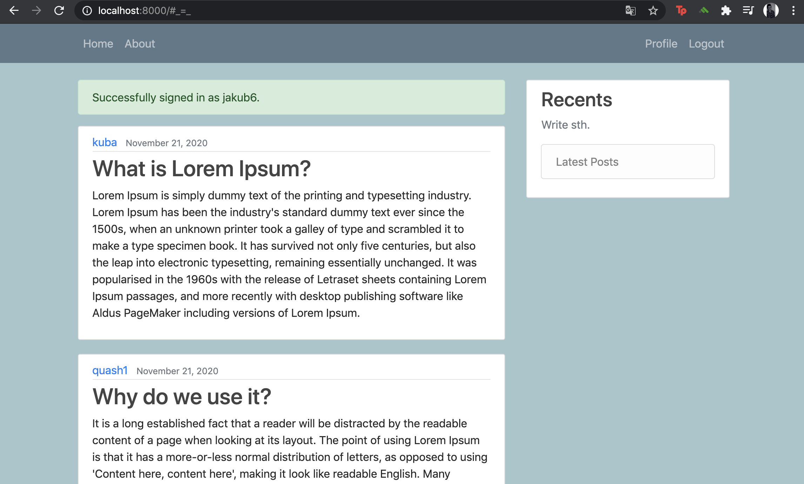
profil zalogowanego uzytkownika:
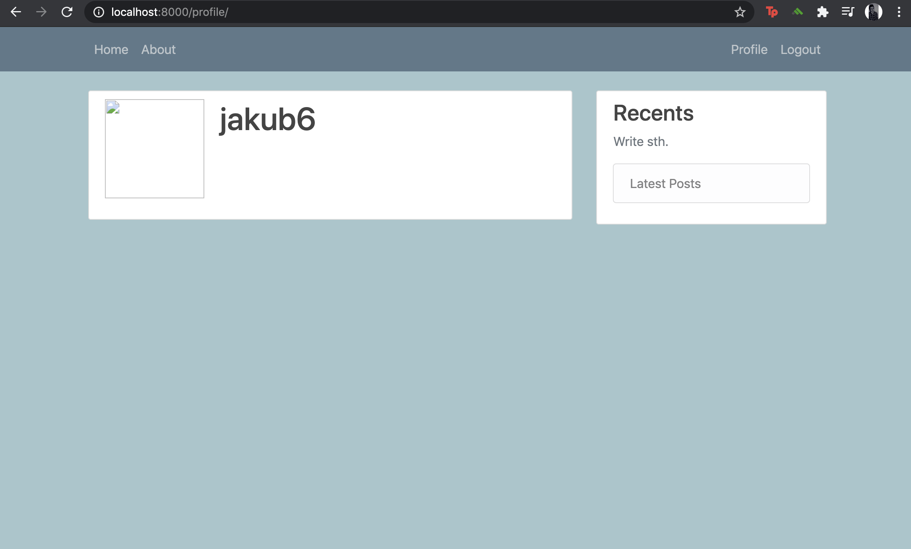
Ustawienia developerskie facebook:
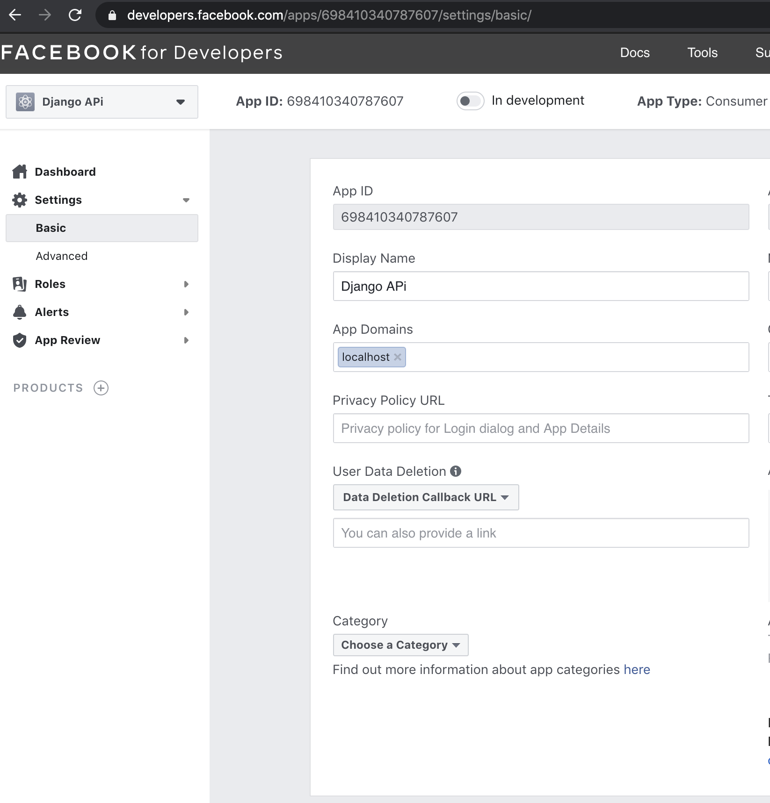

DJANGO ADMIN:
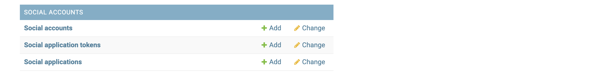
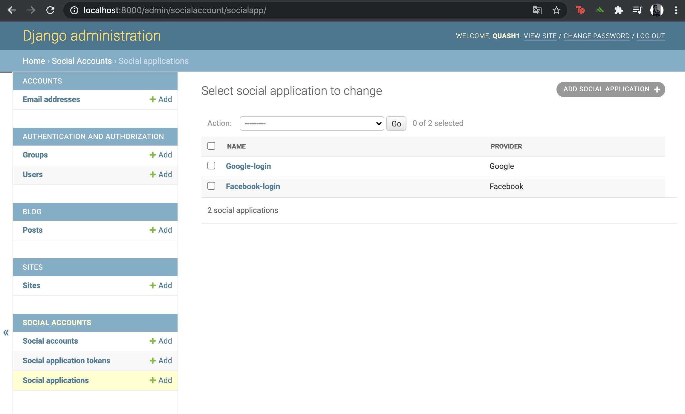