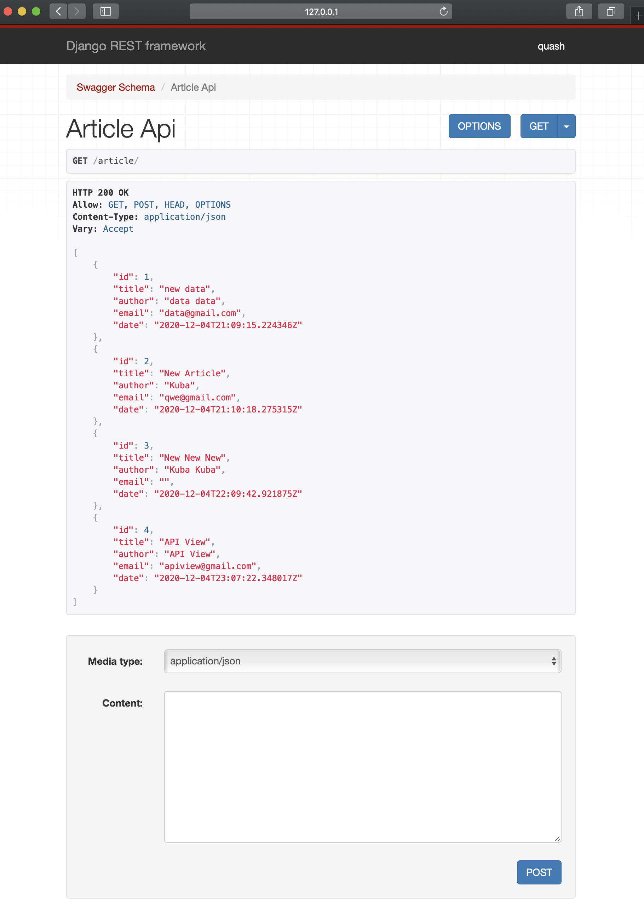
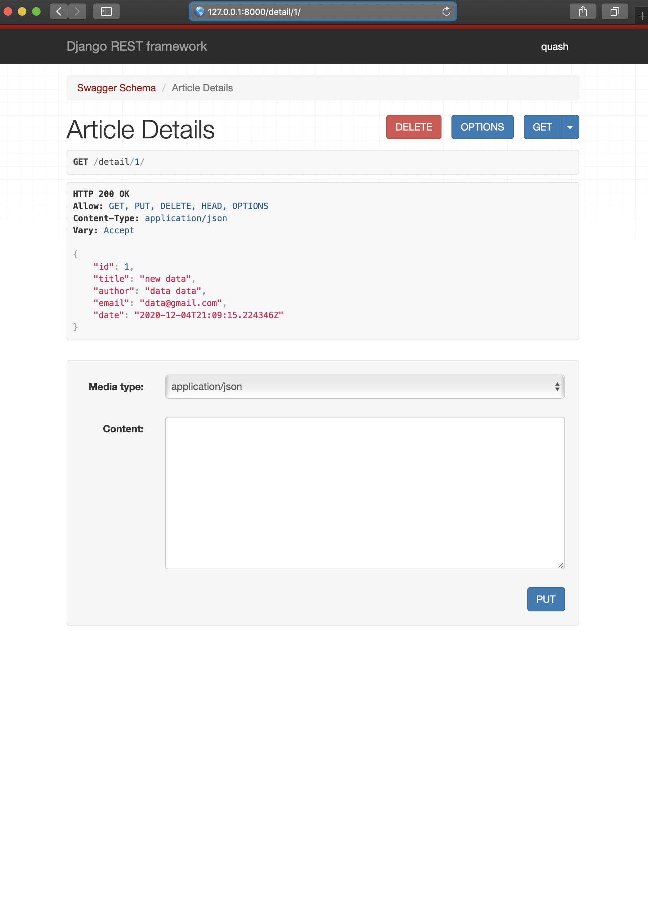
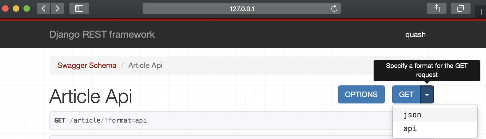
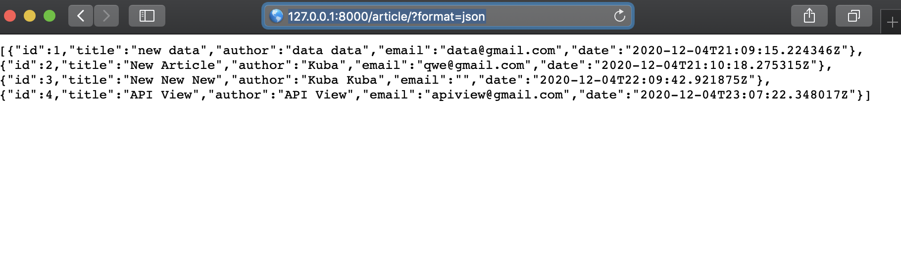
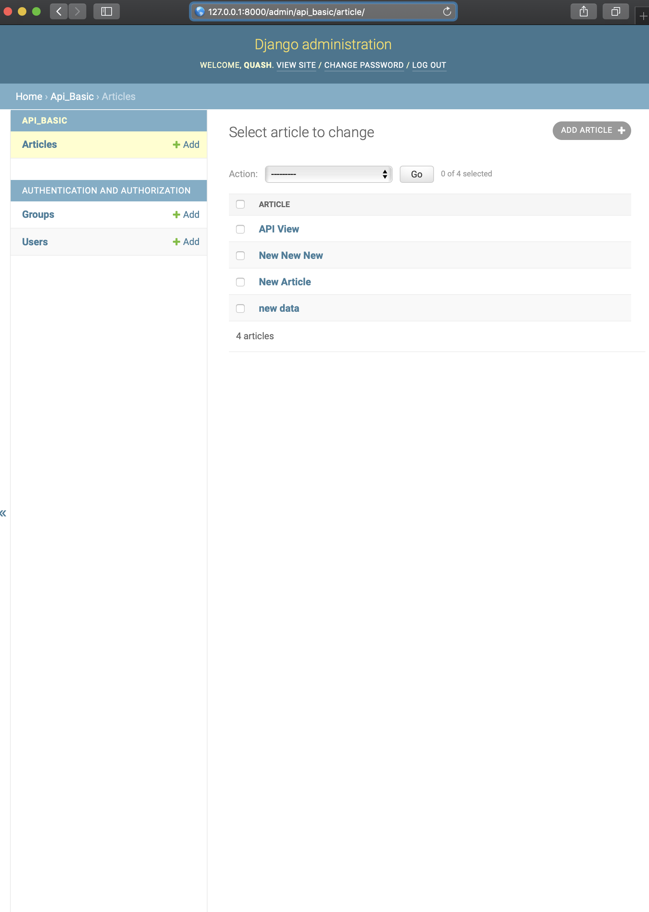

# Laboratorium nr 4 - API Rest Framework Django

Do stworzenia aplikacji api_basic uzylem rest framework

Dostępne url:
* article/< id >
* detail/< id >

Id postów są ustawiane automatycznie za sprawą serializera. Atrybuty posta:
    -id
    -autor
    -mail
    -data

Gdy wejdziemy w detail/id mamy interfejs z usuwaniem oraz edytowaniem postów

Widok json:

Z widoku panelu admina mamy wgląd do wszyskich wpisów:
