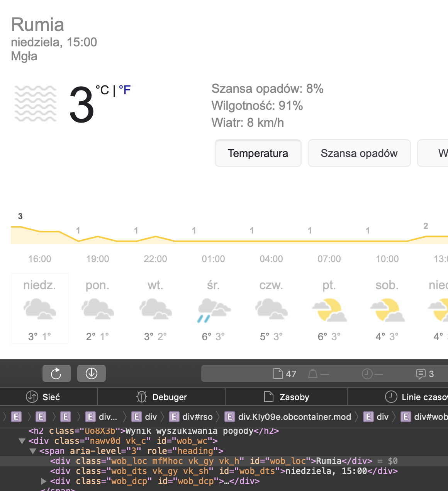
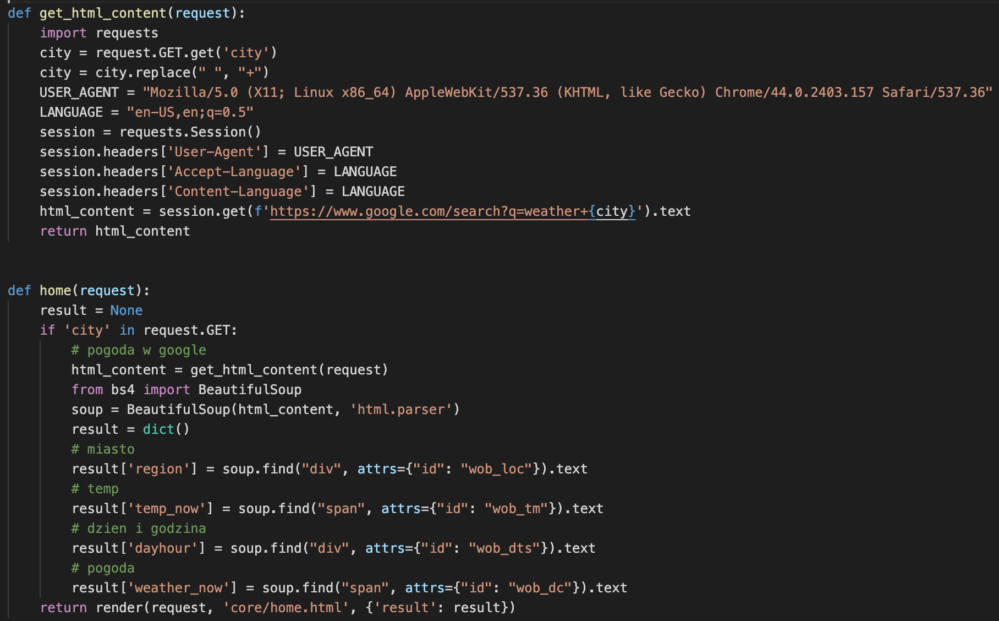
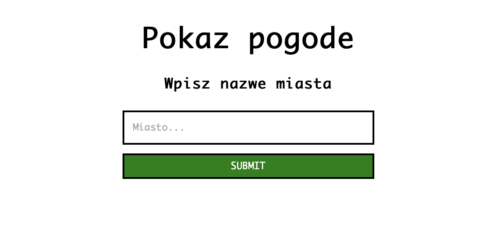
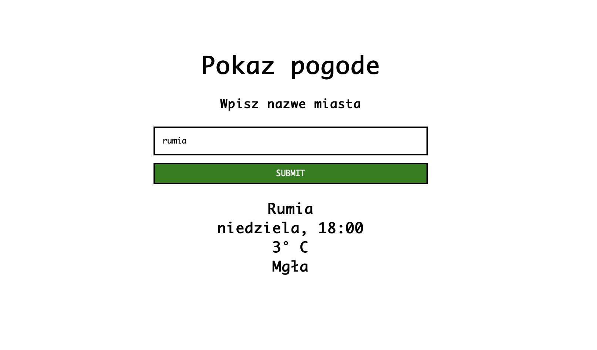
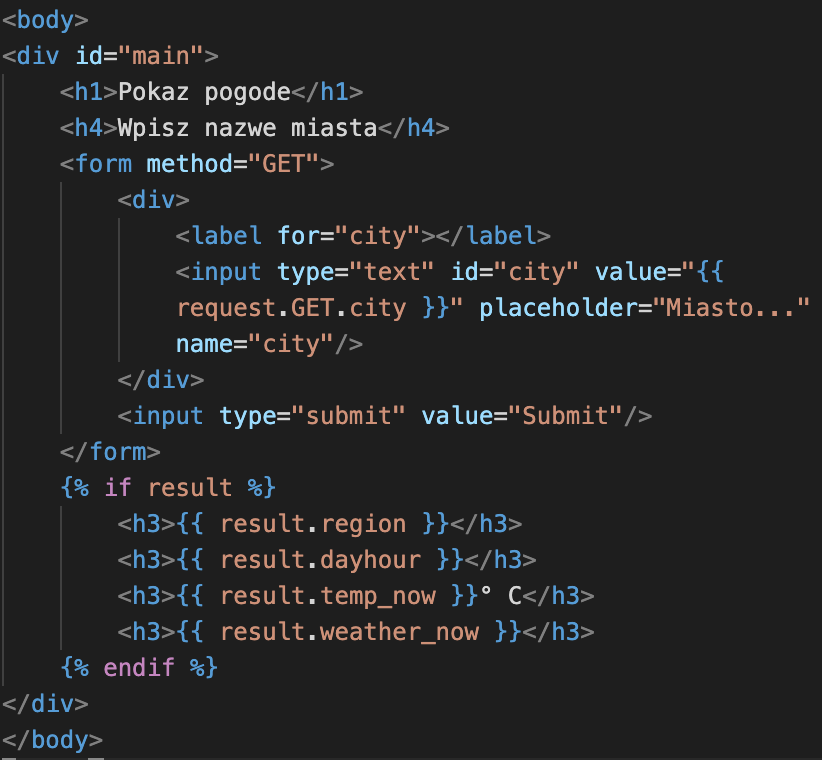

# Laboratorium nr 5 - WebScrapper

Stworzyłem aplikacje do pokazywania danych o pogodzie, temperaturze, godzinie, pobranych z google, po wpisaniu w formularzu danego miasta.

Install req:

Kod strony

Tutaj szukamy odpowiednich pól, mianowicie, gdzie znajduje się nazwa miasta, temperatura, stan pogody oraz godzina.

Funkcja render

Wyglad apki:

Przykład:

Metoda Get:
