# Laboratorium nr 6 -  Zezwolenia i uwierzytelnianie w DRF

Dodanie licznika wejsc(cookie)
Dodanie widoku: login, logout, password reset, password reset-confirm
Widok rejestracji django rest-auth

Login:
# http://127.0.0.1:8000/api/v1/rest-auth/login/
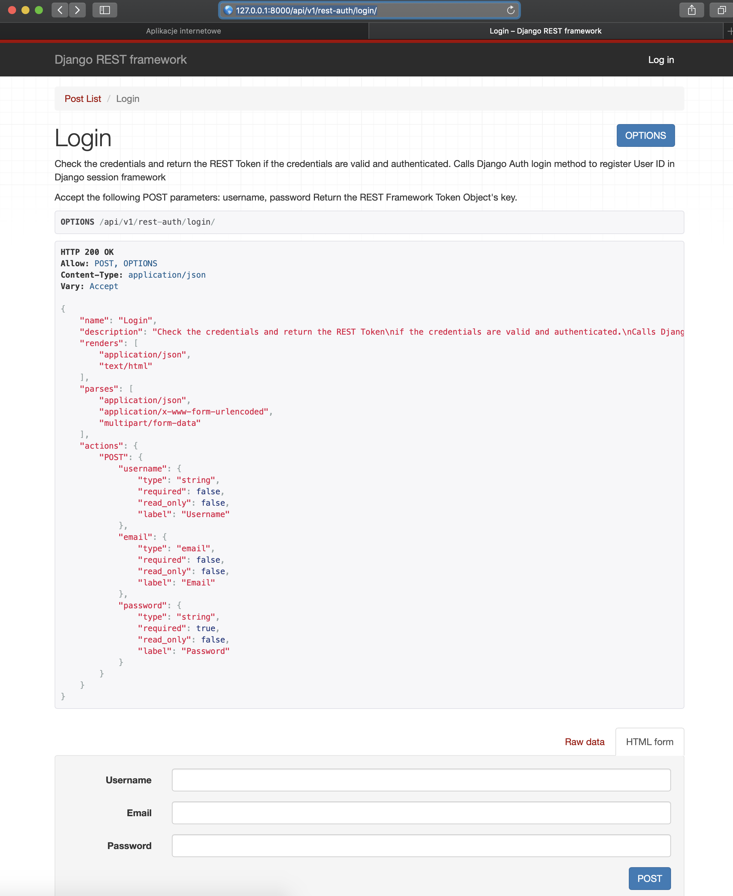

Logout:
# http://127.0.0.1:8000/api/v1/rest-auth/logout/
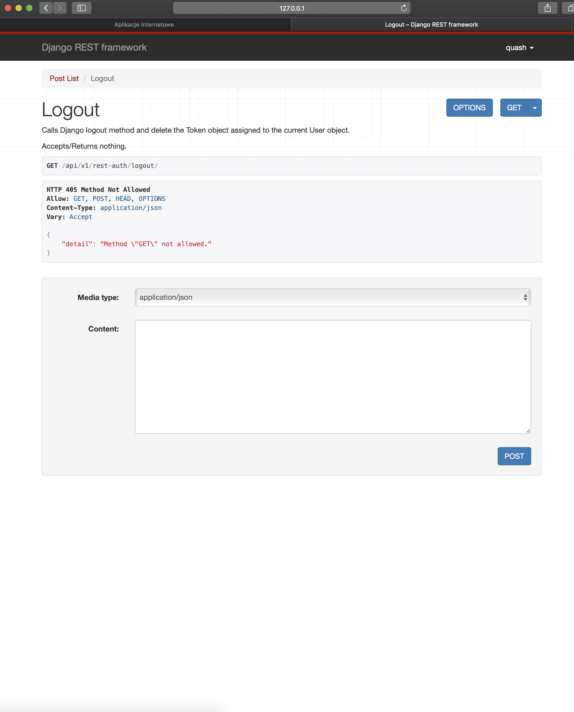

Reset password:
# http://127.0.0.1:8000/api/v1/rest-auth/password/reset/
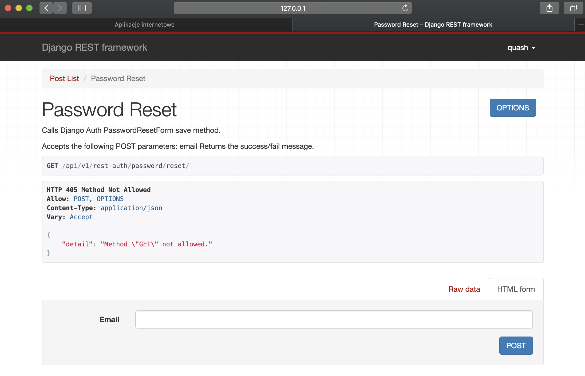

Reset password confirm:
# http://127.0.0.1:8000/api/v1/rest-auth/password/reset/confirm/
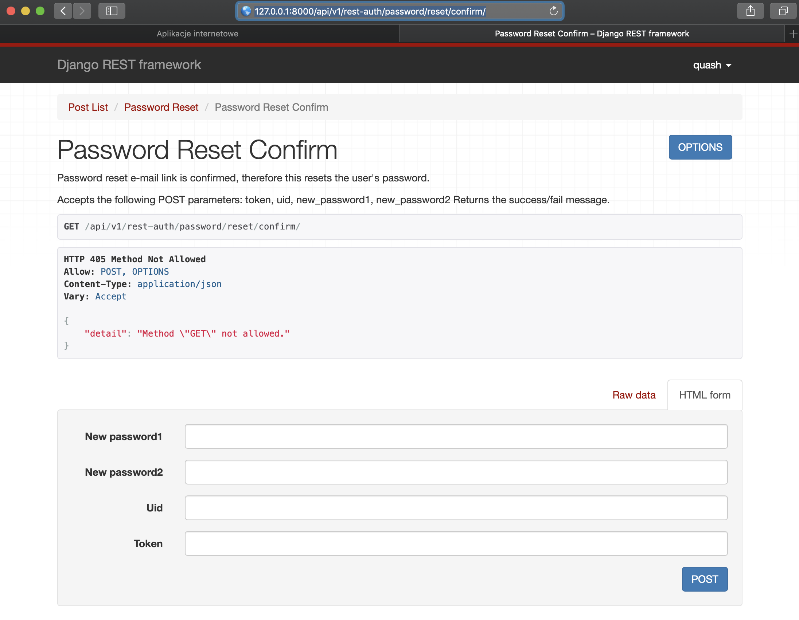

Registration:
# http://127.0.0.1:8000/api/v1/rest-auth/registration
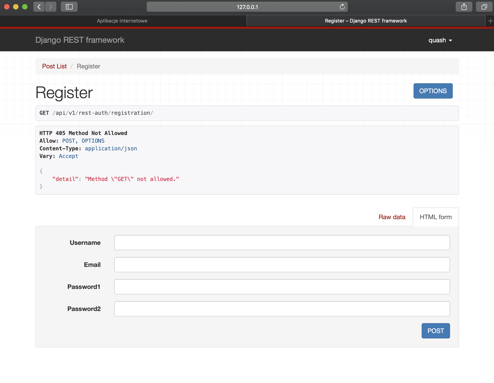

Rejestracja nowego uzytkownika:
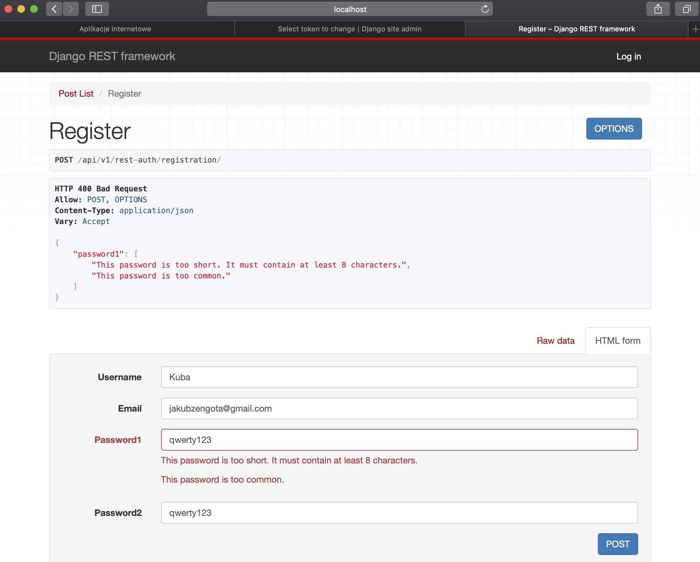
Otrzymujemy token po załozeniu konta:
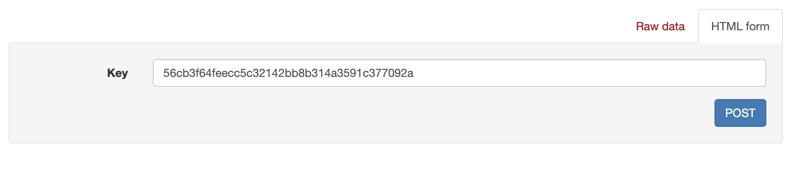
Otrzymany mail  z potwierdzeniem w konsoli:
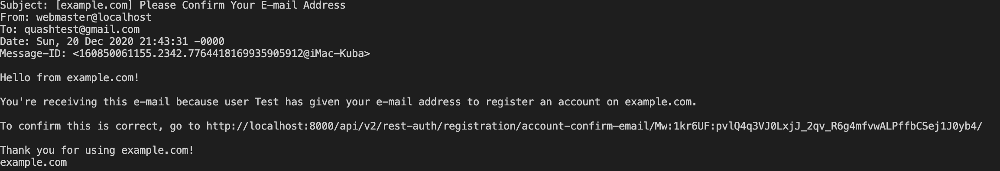

Tokeny uwierzytelniajace + email zwracany.
Wgląd do widoku postów mają tylko uzytkownicy z tokenem
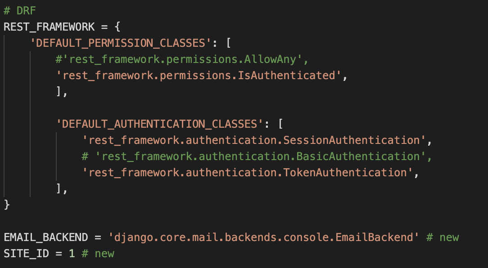

Widok tokenów:
# http://127.0.0.1:8000/admin/authtoken/tokenproxy/
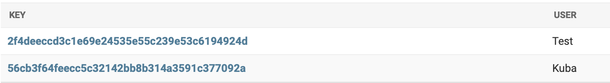

Router:
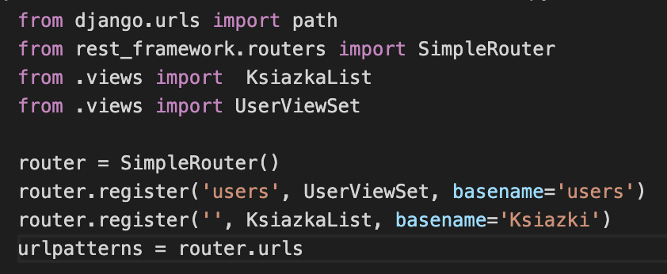
Viewset:
nie posiadamy metod takich jak get()
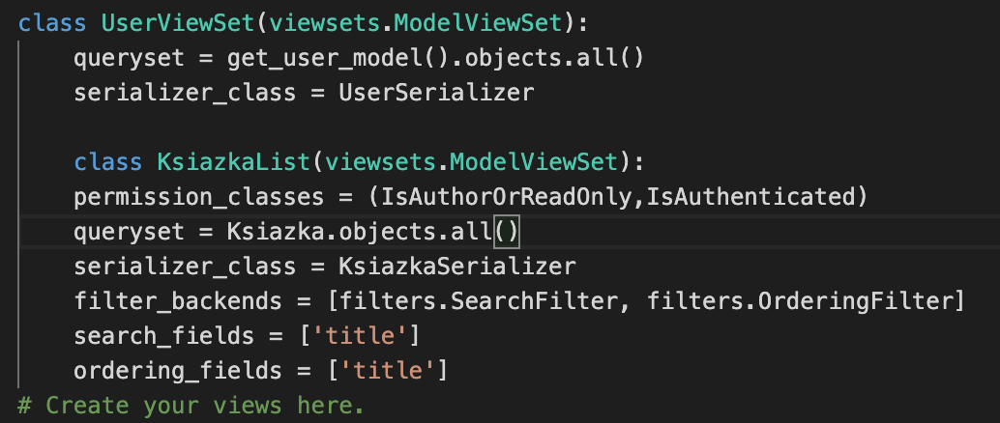

Licznik wizyt oraz informacja o ostatniej wizycie:

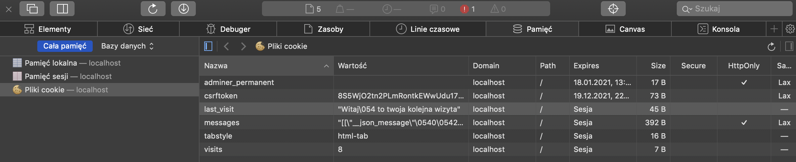
W samym kodzie ustawiamy ilosc odwiedzin jezeli ich nie ma na 0 i jezeli wizyta nastąpi wartosc++
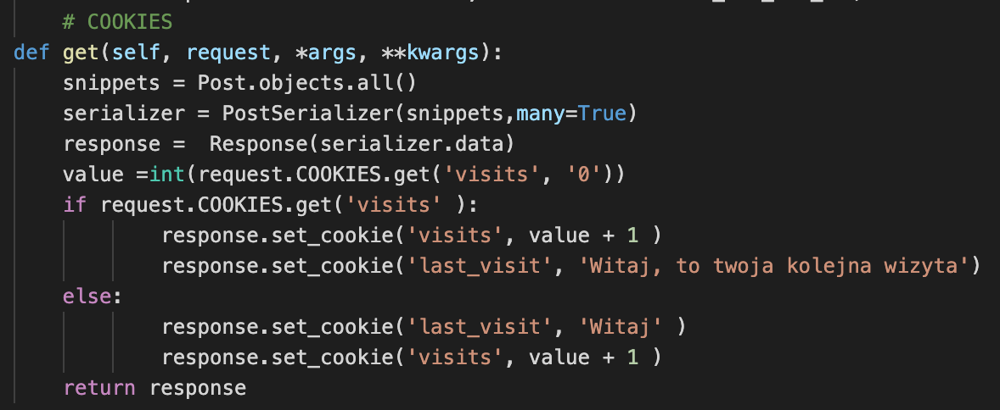

