# Laboratorium nr 7 -  Python + Django + Redis

Uruchamianie redisa poprzez dockera:

Sprawdzenie połączenia z Redisem:

Poprawna konfiguracja:

Przyklad 1:
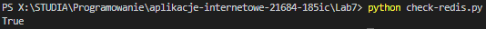

Redis-cli:
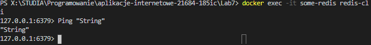

Przyklad 2(String):
Bez decode_responses = True:
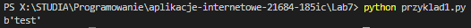
decode_responses = True:
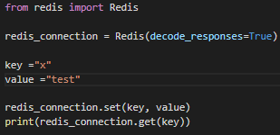
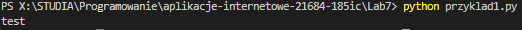
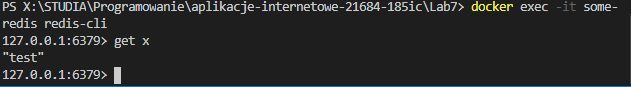

Przyklad 3:
Nadpisanie instniejącej wartości z kluczem + dołączenie do niej drugiego stringa + usuwanie(delete)
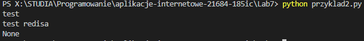

Przyklad 4:
Float / int:
INCR - dodaj
DECR - odejmij
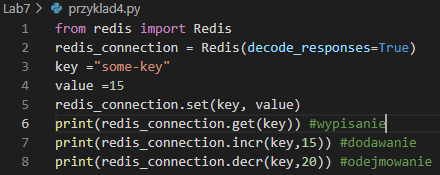
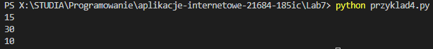

Przykład 5:
Listy:
LPUSH - dodawanie na poczatek listy
RPUSH - dodawanie na koniec

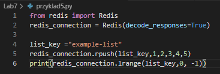
Wyświetlenie tylko indeksów od 1-3:
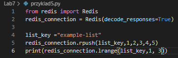
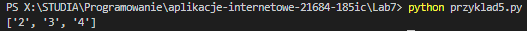

Przykład 6:
LPOP - usuwanie i zwracanie pierwszego elementu listy
RPOP - usuwanie i zwracanie ostatniego elementu listy
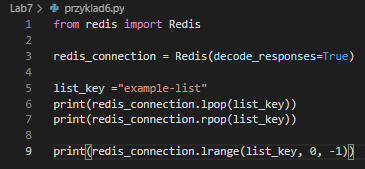
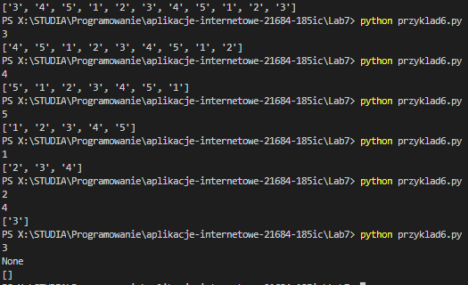

Przykład 7:
SELECT:
Tutaj mamy doczynienia z bazami indeksowanymi od 0 do 15.

W pierwszym wyświetleniu zwróci nam none, bo nie mamy podanego klucza do pierwszej przestrzeni
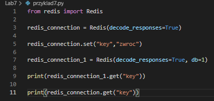
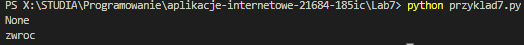

Przyklad 8:
TTL - określa żywotność dla wybranego klucza. Po upłynięciu delay'u jest usuwany.
SETEX:
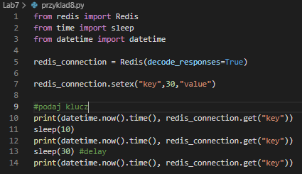
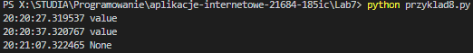
SET/EXPIRE(działanie kodu takie samo):
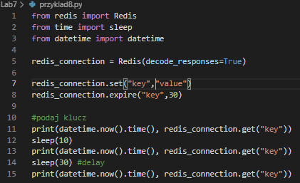

Przykład 9:
Zbiory:
Bez sortowanie:
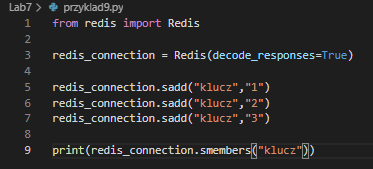
Tutaj otrzymamy losową kolejność
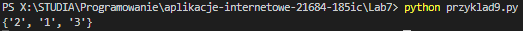

Przyklad 10:
Sortowanie:
zrange - pokazuje sortowanie wg wartości
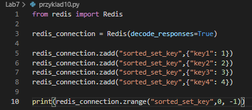
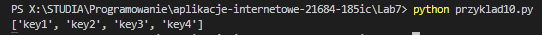

Przyklad 11:
Hashe - są to mapy między polami ciągów a wartościami.
HSET- ustawia pole w hashu przechowywanym w kluczu
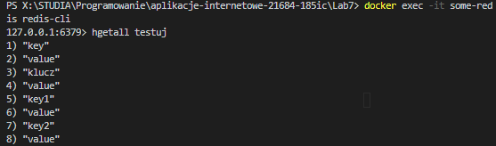
Można tym w łatwy sposób tworzyć obiekty z wartościami np gracz z liczbą zycia, wytrzymałość i inne atrybuty.
cli:
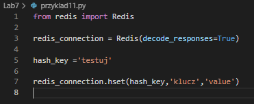

Przykład 12:
Publish:
PUBSUB:
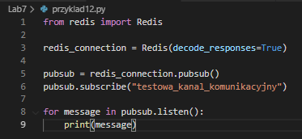
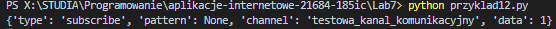
SUBSCRIBE - metoda która daje subskrybcje klienta do wybranego kanału
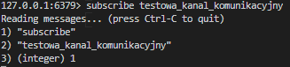

Przykład 13:
Strumienie:

