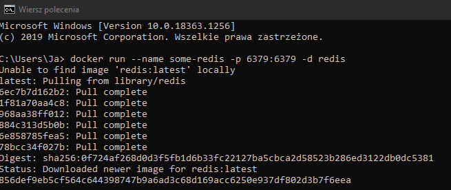

# Laboratorium nr 7 -  Python + Django + Redis

Uruchamianie redisa poprzez dockera:

Sprawdzenie połączenia z Redisem:

Poprawna konfiguracja:

Przyklad 1:

Redis-cli:

Przyklad 2(String):
Bez decode_responses = True:

decode_responses = True:

Przyklad 3:
Nadpisanie instniejącej wartości z kluczem + dołączenie do niej drugiego stringa + usuwanie(delete)

Przyklad 4:
Float / int:
INCR - dodaj
DECR - odejmij

Przykład 5:
Listy:
LPUSH - dodawanie na poczatek listy
RPUSH - dodawanie na koniec

Wyświetlenie tylko indeksów od 1-3:

Przykład 6:
LPOP - usuwanie i zwracanie pierwszego elementu listy
RPOP - usuwanie i zwracanie ostatniego elementu listy

Przykład 7:
SELECT:
Tutaj mamy doczynienia z bazami indeksowanymi od 0 do 15.

W pierwszym wyświetleniu zwróci nam none, bo nie mamy podanego klucza do pierwszej przestrzeni

Przyklad 8:
TTL - określa żywotność dla wybranego klucza. Po upłynięciu delay'u jest usuwany.
SETEX:

SET/EXPIRE(działanie kodu takie samo):

Przykład 9:
Zbiory:
Bez sortowanie:

Tutaj otrzymamy losową kolejność

Przyklad 10:
Sortowanie:
zrange - pokazuje sortowanie wg wartości

Przyklad 11:
Hashe - są to mapy między polami ciągów a wartościami.
HSET- ustawia pole w hashu przechowywanym w kluczu

Można tym w łatwy sposób tworzyć obiekty z wartościami np gracz z liczbą zycia, wytrzymałość i inne atrybuty.
cli:

Przykład 12:
Publish:
PUBSUB:

SUBSCRIBE - metoda która daje subskrybcje klienta do wybranego kanału

Przykład 13:
Strumienie:

