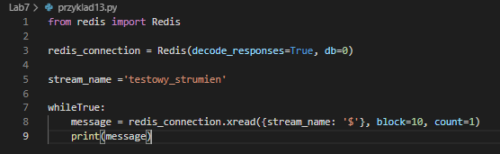

# Laboratorium nr 7 -  Python + Django + Redis

## Uruchamianie redisa poprzez dockera:

## Poprawna konfiguracja:

## Przyklad 1:

## Redis-cli:

## Przyklad 2(String):
### Bez decode_responses = True:

## decode_responses = True:

## Przyklad 3:
### Nadpisanie instniejącej wartości z kluczem + dołączenie do niej drugiego stringa + usuwanie(delete)

## Przyklad 4:
### Float / int:
* INCR - dodaj
* DECR - odejmij

##  Przykład 5:
### Listy:
#### LPUSH - dodawanie na poczatek listy
#### RPUSH - dodawanie na koniec

### Wyświetlenie tylko indeksów od 1-3:

## Przykład 6:
### LPOP - usuwanie i zwracanie pierwszego elementu listy
### RPOP - usuwanie i zwracanie ostatniego elementu listy

## Przykład 7:
### SELECT:
#### Tutaj mamy doczynienia z bazami indeksowanymi od 0 do 15.

### W pierwszym wyświetleniu zwróci nam none, bo nie mamy podanego klucza do pierwszej przestrzeni

## Przyklad 8:
### TTL - określa żywotność dla wybranego klucza. Po upłynięciu delay'u jest usuwany.
### SETEX:

### SET/EXPIRE(działanie kodu takie samo):

## Przykład 9:
### Zbiory:
### Bez sortowanie:

### Tutaj otrzymamy losową kolejność

## Przyklad 10:
### Sortowanie:
### zrange - pokazuje sortowanie wg wartości

## Przyklad 11:
### Hashe - są to mapy między polami ciągów a wartościami.
### HSET- ustawia pole w hashu przechowywanym w kluczu

### Można tym w łatwy sposób tworzyć obiekty z wartościami np gracz z liczbą zycia, wytrzymałość i inne atrybuty.
### cli:

## Przykład 12:
### Publish:
### PUBSUB:

### SUBSCRIBE - metoda która daje subskrybcje klienta do wybranego kanału

## Przykład 13:
### Strumienie:
### Wiadomości które wklimy do strumienia znajdą się nakoncu. Nie można dodać w konkretne miejsce!

### Te liczby to czas od 1 stycznia 1970 + numer sekwencji

### Dodajmy element strumienia

### Cli - dodanie strumienia

### redis_connection.xdel(stream_name, msg_id) - aby elementy nie były zgubione

## Przykład 14:
### Pipelining - inaczej przetwarzanie potokowe, które pozwala wysyłanie wielu instrukcji do redisa na raz.

### Pokazanie sprawdzania kluczy, czy są takie same.

### Błąd pokazuje zmiane kluczy

### Transakcje - Integrowanie kilku operacji w jedną całość.
* MULTI - rozpoczęcie transakcji. Zwracanie rezultatu wykonanych komend.
* EXEC - kolejne polecenia umieszczane w kolejce
* DISCARD - opóżnia wszystkie poprzednio umieszczone w kolejce polecania.
* WATCH - zaznacza klucze które mają być obserwowane w celu wykonania transakcji.

## Przykład 15:
### LUA 
### eval - przekazanie ciała skryptu. Wykonanie operacji i wyswietlenie wyniku. Drugi argument(0) to ilosc argumentów które mozna przekazać do skryptu 

### Przekazanie dwóch kluczy i dworch argumentów:

### Zwrócenie 10-elementowej tablicy:

## Przykład 16:
### Format JSON - dodawanie 2 liczb.

### Format JSON dodawanie 10 i 5:

###Tutaj możemy zobaczyć ze pierwsze wyświetla się "none", jest to efekt funkcji eval(zwraca null), a w key 2 wynik.

### Cache:

# Django Celery:
## Instalacja:
## Wchodzimy w wirtualne srodowisko i wpisujemy:
* pip install Django Celery redis Pillow django-widget-tweaks
* pip freeze > requirements.txt

## Tworzenie celery.py:

## Settings.py:
## +aplikacja widget_tweaks

## plik _init_.py:
 

## thumbnailer/tasks.py:
 
## Redis cli bez dockera:
  

## Run celery:
### "celery -A image_parroter worker -l info -P gevent"
    

### Wygląd strony tumbnailer:
  
### Pobrane zdjęcie:
 

 ## Zapytania do serwera:
 
## Konsola celery:
 

## Taski:
 
 ## Teraz wpisujemy komende :
 ## celery -A image_parroter beat -l INFO --scheduler django_celery_beat.schedulers:DatabaseScheduler
  

## ..oraz:
##celery -A image_parroter worker -l info -P gevent
  
