# Laboratorium nr 8 - Czat z użyciem Web Socket + Web Workers

## 1. Socket chat
### Tworzymy folder wraz z plikiem package.json
### npm install express@4
### 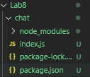
### odpalamy projekt poleceniem:
### node index.js
### 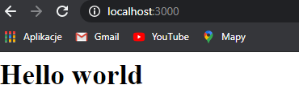
### Instalacja socketów:
### 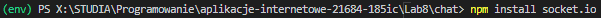
### stworzenie podstawowego widoku index.html:
### 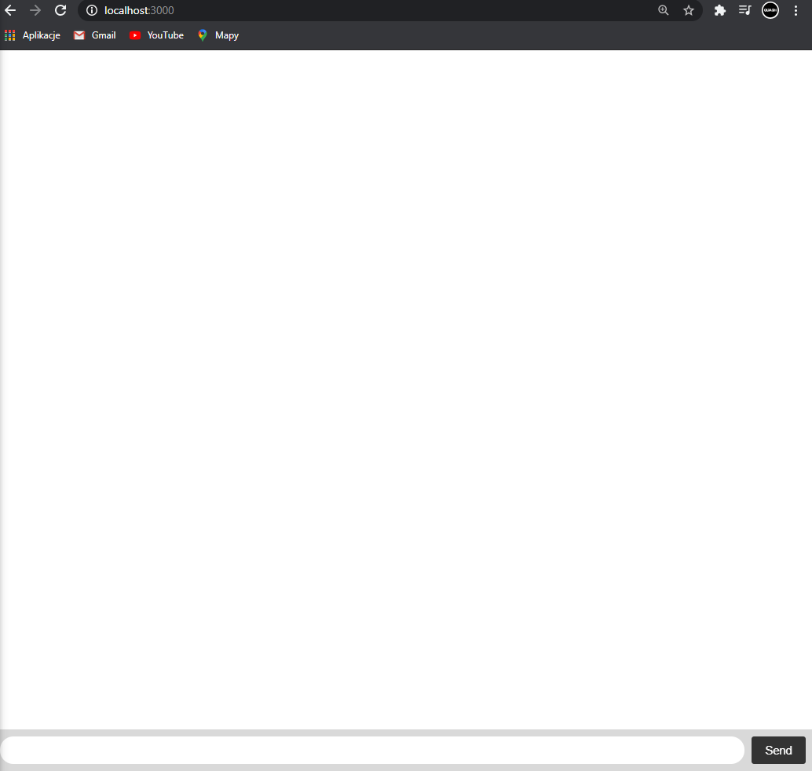
### Nasłuchiwanie zdarzenia connection
### 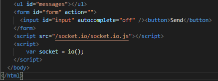
### 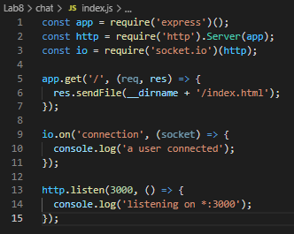
### 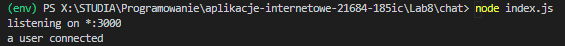
### Nasłuchiwanie zdarzenia connection - disconected
### 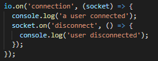
### 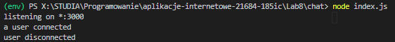
### Pisanie na czacie:
### 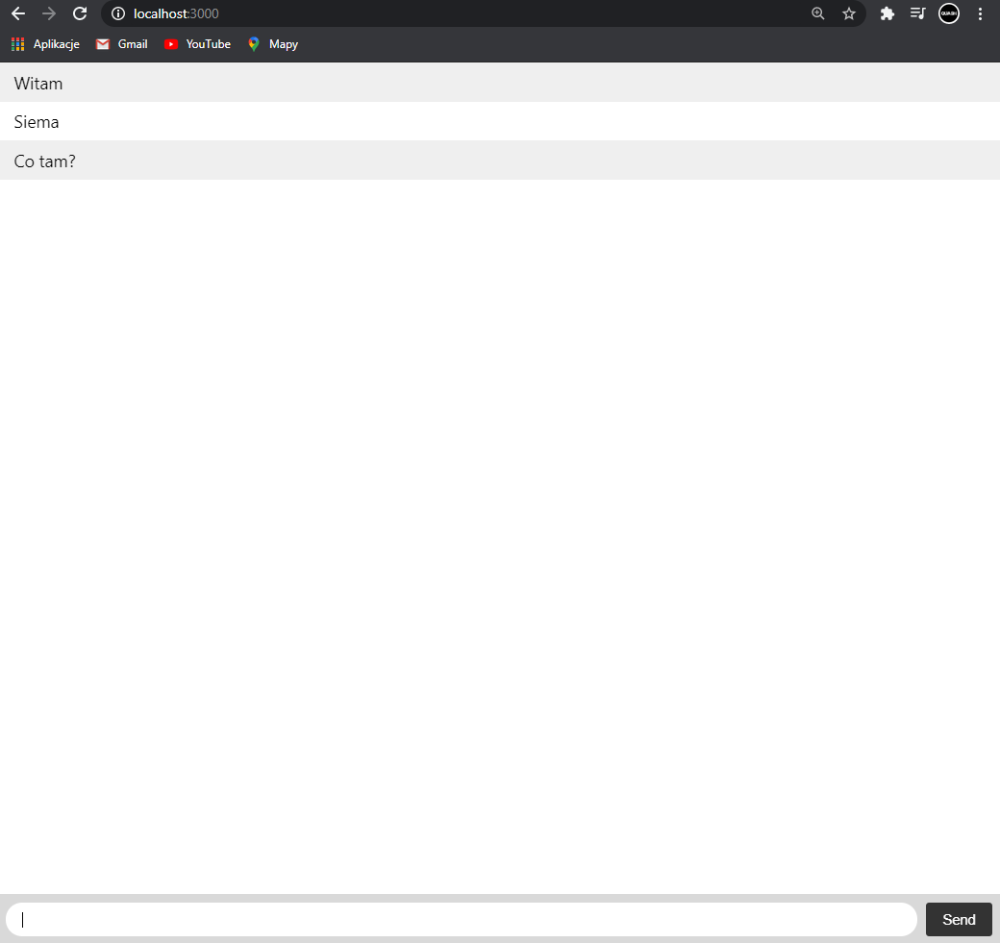
### 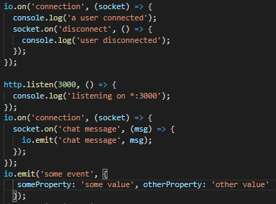
### 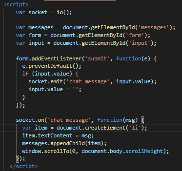

## 2.Workers
### 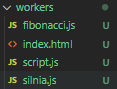
### Aby bez pomocy django utworzyć projekt, musimy włączyć python server:
### 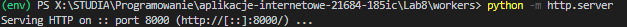
### Wygląd strony:
### 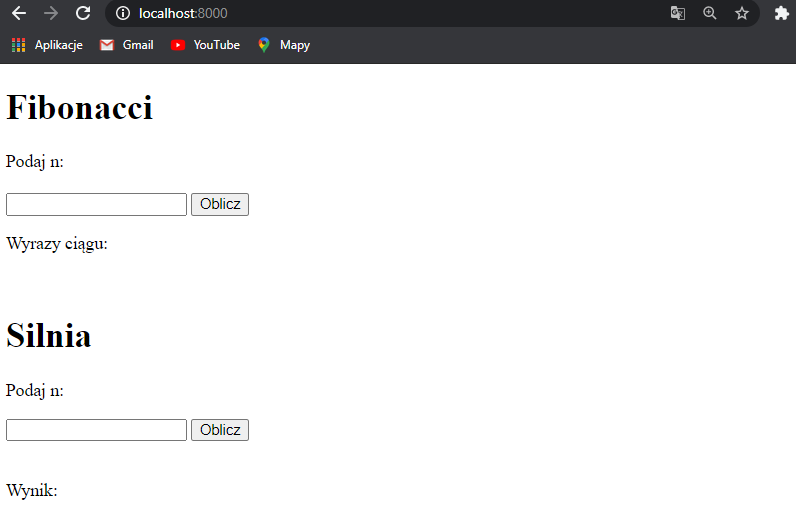
### Działanie:
### 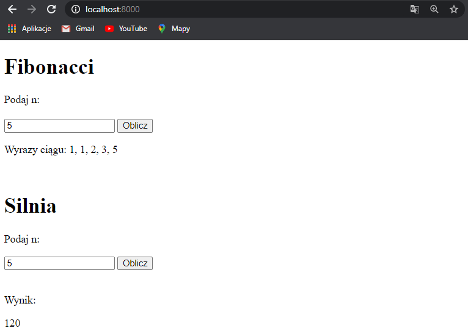
### 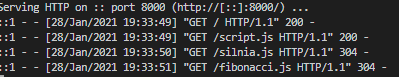
### Gdy podamy złe dane otrzymamy błąd:
### 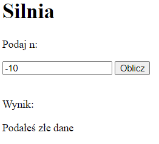
### fibonacci.js:
### 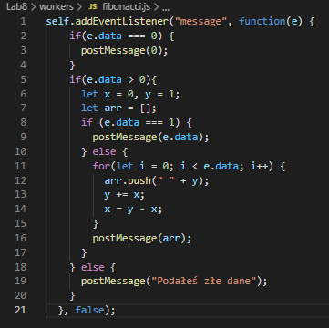
### silnia.js:
### 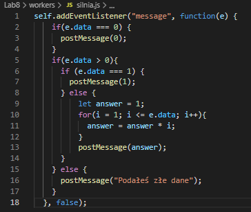
### script.js
### Tworzenie workerów ( new Worker())
### onmessage -> EventHandler, który będzie wywołany gdy będzie zdarzenie
### 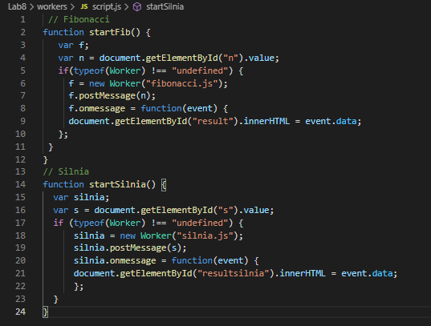
### index.js - kod:
### 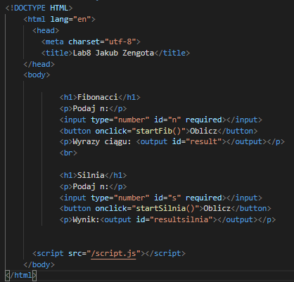
### index.js - przekazanie danych poprzez input
### 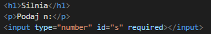
